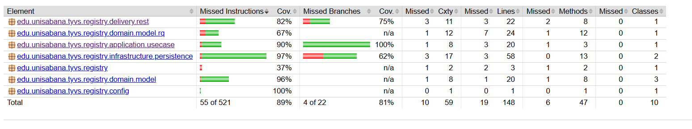
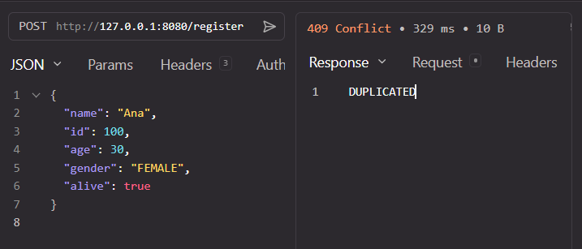
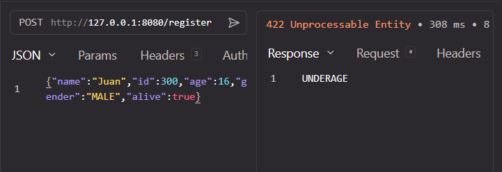
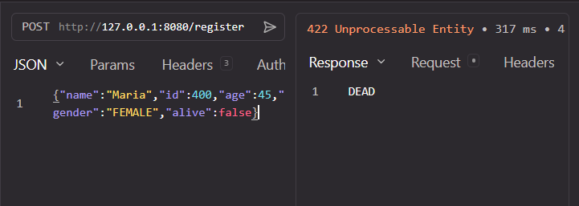
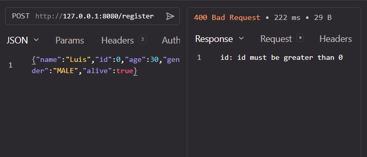

# 🗳️ Registraduría — Taller de Pruebas de Integración y Sistema

[](https://openjdk.org/)
[](https://junit.org/junit4/)
[](https://site.mockito.org/)
[](https://www.h2database.com/)
[](https://spring.io/)
[](https://www.jacoco.org/jacoco/)
[](https://maven.apache.org/)
[](https://www.postman.com/juandavid-4672575/workspace/juan-david/collection/43956930-b372aee3-9745-4594-9f76-093b5e7bfa47)

> Implementación de **pruebas de integración** (H2 + Mockito) y **pruebas de sistema** (HTTP) sobre una **Arquitectura Limpia** con Spring Boot.

---

## 👤 Integrantes

| Nombre | Programa |
|---|---|
| Juan David Cruz Ángel | Ingeniería de Software |

**Universidad:** Universidad de La Sabana  
**Año:** 2026

---

## 🎯 ¿Qué hace este proyecto?

El sistema valida si una persona puede registrarse como votante en la Registraduría. El endpoint `POST /register` procesa la solicitud a través de **4 capas** y aplica las reglas de negocio:

```
HTTP Request ──► Controller ──► Registry ──► Repository (H2)
     │                │             │              │
     │                │             │              └─ persistencia real
     │                │             └─ 5 reglas de negocio
     │                └─ @Valid + @ExceptionHandler
     └─ JSON con datos de la persona
                     │
              1. ¿Validación @Valid? → 400 BAD REQUEST
              2. ¿Género válido?     → 400 INVALID_GENDER
              3. ¿Persona null?      → INVALID
              4. ¿ID inválido?       → INVALID
              5. ¿Está viva?         → UNDERAGE (si < 18) / DEAD (si !alive)
              6. ¿ID duplicado?      → DUPLICATED
              7. Todo correcto       → VALID
```

---

## 🗂️ Estructura del proyecto

```
registraduria/
 ├─ src/main/java/edu/unisabana/tyvs/registry/
 │   ├─ RegistryApplication.java           # Punto de entrada Spring Boot
 │   ├─ config/
 │   │   └─ RegistryConfig.java            # Beans de Spring (repo + usecase)
 │   ├─ domain/model/
 │   │   ├─ Person.java                    # Modelo inmutable del votante
 │   │   ├─ Gender.java                    # MALE | FEMALE
 │   │   ├─ RegisterResult.java            # VALID | DEAD | INVALID | UNDERAGE | DUPLICATED
 │   │   └─ rq/PersonDTO.java              # DTO con @Valid, @NotBlank, @Min
 │   ├─ application/
 │   │   ├─ usecase/Registry.java          # Caso de uso: 5 reglas de negocio
 │   │   └─ port/out/RegistryRepositoryPort.java  # Puerto de salida
 │   ├─ infrastructure/persistence/
 │   │   ├─ RegistryRepository.java        # Implementación JDBC + H2
 │   │   └─ RegistryRecord.java            # Record para filas de la tabla
 │   └─ delivery/rest/
 │       └─ RegistryController.java        # REST endpoint POST /register
 │
 ├─ src/test/java/edu/unisabana/tyvs/registry/
 │   ├─ AppTest.java
 │   ├─ application/usecase/
 │   │   ├─ RegistryTest.java              # 9 pruebas H2 (integración real)
 │   │   └─ RegistryWithMockTest.java      # 3 pruebas Mockito (repositorio simulado)
 │   └─ delivery/rest/
 │       └─ RegistryControllerIT.java      # 7 pruebas HTTP (sistema end-to-end)
 │
 ├─ pom.xml                                # Maven + H2 + Mockito + Spring Test + JaCoCo
 ├─ defectos.md                            # 6 defectos documentados
 ├─ integrantes.txt                        # Nombres y correos
 ├─ registraduria-collection.json          # Colección Postman/Newman
 └─ evidencias/                            # Capturas de pantalla
    ├─ evidencia-200-valid.png
    ├─ evidencia-409-duplicated.png
    ├─ evidencia-422-underage.png
    ├─ evidencia-422-dead.png
    ├─ evidencia-400-invalid-id.png
    └─ evidencia-jacoco-cobertura.png

```

---

## 🚀 Cómo ejecutar

### Prerrequisitos

- Java 21+
- Maven 3.6+

### Compilar y ejecutar todas las pruebas

```bash
cd registraduria

# Solo pruebas unitarias
mvn clean test

# Unitarias + integración + sistema + reporte JaCoCo
mvn clean verify

# Ver el reporte de cobertura
open target/site/jacoco/index.html   # macOS
# o
xdg-open target/site/jacoco/index.html  # Linux
```

### Resultado esperado de `mvn clean verify`

```
[INFO] T E S T S
[INFO] Running edu.unisabana.tyvs.registry.application.usecase.RegistryTest
[INFO] Tests run: 9, Failures: 0, Errors: 0, Skipped: 0
[INFO] Running edu.unisabana.tyvs.registry.application.usecase.RegistryWithMockTest
[INFO] Tests run: 3, Failures: 0, Errors: 0, Skipped: 0
[INFO] Running edu.unisabana.tyvs.registry.AppTest
[INFO] Tests run: 1, Failures: 0, Errors: 0, Skipped: 0
[INFO] Running edu.unisabana.tyvs.registry.delivery.rest.RegistryControllerIT
[INFO] Tests run: 7, Failures: 0, Errors: 0, Skipped: 0

[INFO] Tests run: 20, Failures: 0, Errors: 0, Skipped: 0
[INFO] BUILD SUCCESS
```

### Ejecutar la colección Postman con Newman

```bash
npx newman run registraduria-collection.json
```

---

## 📊 Cobertura JaCoCo

| Paquete | Instrucciones | Branches | Estado |
|---|---|---|---|
| `application.usecase` (Registry) | **90%** ✅ | **100%** ✅ | Cumplido (≥ 70%) |
| `delivery.rest` (Controller) | **82%** ✅ | **75%** ✅ | Cumplido (≥ 70%) |
| `infrastructure.persistence` | **97%** | **62%** | Alto |
| `domain.model` | **96%** | n/a | Alto |
| `config` | **100%** | n/a | Completo |
| **Total global** | **89%** ✅ | **81%** ✅ | Cumplido (≥ 80%) |



> El total global del **89%** supera el requisito mínimo del 80%. Los paquetes `application` (90%) y `delivery` (82%) superan el 70% requerido.

---

## 🧪 Pruebas implementadas

### Integración con H2 (9 pruebas)

| # | Método | Qué valida | Resultado |
|---|---|---|---|
| 1 | `shouldRegisterValidPerson` | Persona válida se registra y persiste | `VALID` |
| 2 | `shouldPersistValidVoterAndRejectDuplicates` | Duplicado detectado en BD real | `DUPLICATED` |
| 3 | `shouldReturnUnderageWhenPersonIsLessThan18` | Menor de edad (16 años) | `UNDERAGE` |
| 4 | `shouldReturnDeadWhenPersonIsNotAlive` | Persona fallecida | `DEAD` |
| 5 | `shouldReturnInvalidWhenIdIsZeroOrNegative` | ID = 0 y ID = -1 | `INVALID` |
| 6 | `shouldReturnInvalidWhenPersonIsNull` | Referencia null | `INVALID` |
| 7 | `shouldFindSavedPersonById` | Persistencia verificada con `findById()` | `RegistryRecord` |
| 8 | `shouldReturnEmptyWhenPersonNotFound` | ID inexistente retorna vacío | `Optional.empty()` |
| 9 | `shouldUseFullConstructorForRepository` | Constructor con user/password | `VALID` |

### Integración con Mockito (3 pruebas)

| # | Método | Qué valida | Resultado |
|---|---|---|---|
| 1 | `shouldReturnDuplicatedWhenRepoSaysExists` | Mock dice "existe" → no llama save() | `DUPLICATED` |
| 2 | `shouldCallSaveWhenPersonDoesNotExist` | Mock dice "no existe" → llama save() | `VALID` + `verify(save)` |
| 3 | `shouldThrowIllegalStateExceptionWhenSaveFails` | Mock lanza SQLException | `IllegalStateException` |

### Sistema HTTP (7 pruebas)

| # | Método | Qué valida | HTTP | Body |
|---|---|---|---|---|
| 1 | `shouldRegisterValidPerson` | Registro exitoso | 200 OK | `VALID` |
| 2 | `shouldReturn409WhenDuplicatedPerson` | Mismo ID dos veces | 409 | `DUPLICATED` |
| 3 | `shouldReturn422WhenPersonIsUnderage` | Edad = 16 | 422 | `UNDERAGE` |
| 4 | `shouldReturn422WhenPersonIsDead` | `alive = false` | 422 | `DEAD` |
| 5 | `shouldReturn400WhenIdIsInvalid` | ID = 0 (@Valid) | 400 | validación |
| 6 | `shouldReturn400WhenGenderIsInvalid` | `gender = "OTHER"` | 400 | `INVALID_GENDER` |
| 7 | `shouldReturn400WhenJsonMissingFields` | JSON incompleto | 400 | validación |

---

## 📸 Evidencias visuales

### 200 OK — Registro válido


### 409 CONFLICT — Persona duplicada



### 422 UNPROCESSABLE — Menor de edad



### 422 UNPROCESSABLE — Persona fallecida



### 400 BAD REQUEST — ID inválido (@Valid)



---

## 📖 Documentación completa (Wiki)

Toda la documentación técnica está en la carpeta [`wiki/`](wiki/) y en el [Wiki del repositorio](../../wiki/):

| Documento | Contenido |
|---|---|
| [🏠 01 — Inicio](wiki/01-Inicio.md) | Dominio, alcance, equipo y resumen de resultados |
| [📋 02 — Tipos de Pruebas](wiki/02-Tipos-de-Pruebas.md) | Unitarias vs Integración vs Sistema |
| [🏗️ 03 — Arquitectura Limpia](wiki/03-Arquitectura-Limpia.md) | Diagrama de capas + enlaces al código |
| [🗄️ 04 — Pruebas de Integración](wiki/04-Pruebas-de-Integracion.md) | H2 + patrón AAA + 9 casos |
| [🎭 05 — Pruebas con Mockito](wiki/05-Pruebas-con-Mockito.md) | when/verify/never + FakeRepository |
| [🌐 06 — Pruebas de Sistema](wiki/06-Pruebas-de-Sistema.md) | HTTP + @Valid + 7 evidencias visuales |
| [📊 07 — Resultados](wiki/07-Resultados.md) | JaCoCo 89% + Newman 7/7 |
| [📋 08 — Matriz de Pruebas](wiki/08-Matriz-de-Pruebas.md) | 16 casos probados en tabla |
| [💡 09 — Conclusiones](wiki/09-Conclusiones.md) | Reflexión técnica final |
| [🪲 Defectos](defectos.md) | 6 defectos documentados del proceso |

---

## 🔑 Conceptos aplicados

### Pruebas de Integración con H2

Se usa una base de datos **H2 en memoria** (`jdbc:h2:mem:regdb`) para validar la interacción real entre el caso de uso `Registry` y el repositorio `RegistryRepository`. Cada prueba crea la tabla, inserta datos y verifica persistencia con SQL real.

### Pruebas de Integración con Mockito

El repositorio se simula con `mock(RegistryRepositoryPort.class)` para aislar la lógica de negocio. Se usa `when(...).thenReturn(...)`, `verify(...)`, `verify(..., never())` y `doThrow(...).when(...)` para validar interacciones y manejo de errores.

### Pruebas de Sistema (HTTP)

Se valida el comportamiento completo del sistema a través del endpoint `POST /register` usando `TestRestTemplate` (Spring Boot Test) y `Newman` (CLI de Postman). Se prueban códigos HTTP `200`, `400`, `409`, `422` y validaciones con `@Valid`.

### Patrón AAA

Todas las pruebas siguen `// Arrange`, `// Act`, `// Assert` con comentarios explícitos. Una responsabilidad por prueba, una acción por Act.

### Clean Architecture

El dominio (`domain/model`) no tiene ninguna dependencia externa. La capa `application` define puertos (`RegistryRepositoryPort`) que desacoplan el caso de uso de la infraestructura, permitiendo intercambiar entre H2 real, Mockito y cualquier otra implementación.

### Validación con @Valid

Se agregaron anotaciones de Bean Validation en `PersonDTO` (`@NotBlank`, `@Min`) y se configuró `@ExceptionHandler` en el controlador para retornar códigos HTTP adecuados en lugar de errores 500 genéricos.

---

## 📋 Checklist de entrega

- [x] Proyecto compila con `mvn clean verify` sin errores
- [x] `.gitignore` configurado (excluye `target/`, IDE files)
- [x] `integrantes.txt` con nombres y correos
- [x] Rama principal compilable y funcional
- [x] 9 pruebas de integración con H2 (≥ 3 requeridas)
- [x] 3 pruebas con Mockito (≥ 2 requeridas)
- [x] 7 pruebas de sistema HTTP (≥ 2 requeridas)
- [x] Patrón AAA en todas las pruebas
- [x] Validaciones @Valid en PersonDTO
- [x] Cobertura JaCoCo: **89% global**, **90% application**, **82% delivery** (≥ 80% ✅)
- [x] `defectos.md` con 6 defectos documentados
- [x] Wiki completa con 9 secciones
- [x] Matriz de pruebas con 16 casos
- [x] Colección Postman ejecutada con Newman (7/7 passed)
- [x] Evidencias visuales de todas las pruebas HTTP
- [x] Código sin duplicación, constantes extraídas, buen nombrado
